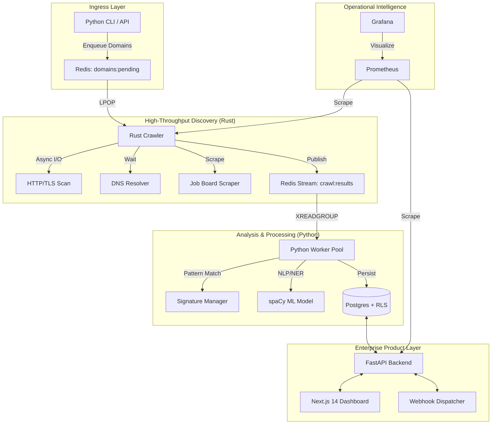

<div align="center">
  
  <h1>TechDetector</h1>
  <p><b>High-Performance Distributed Technographic Discovery Engine</b></p>

  [](https://opensource.org/licenses/MIT)
  [](https://www.rust-lang.org/)
  [](https://www.python.org/)
  [](https://www.docker.com/)
  [](https://kubernetes.io/)
</div>

---

## ⚡ At a Glance

TechDetector is an enterprise-grade discovery engine designed to identify software stacks at massive scale. By combining low-latency network primitives in **Rust** with advanced NLP/ML extraction in **Python**, it provides deep visibility into the technologies powering any organization.

| Feature | Capability |
| :--- | :--- |
| **Throughput** | 1,000+ concurrent domain scans |
| **Signatures** | 1,500+ pattern-based detection rules |
| **NLP Engine** | spaCy-powered NER for job board scraping |
| **Isolation** | Resource-level multi-tenancy via Postgres RLS |
| **Monitoring** | Native Prometheus/Grafana telemetry |

---

## 🏗 System Architecture

TechDetector utilizes a decoupled, stream-based architecture for maximum resilience and horizontal scalability.



---

## 📂 Project Structure

```text
├── api/                # FastAPI backend & controllers
├── dashboard/          # Next.js 14 analytics frontend
├── docker/             # Production-ready Docker configs
├── docs/               # Technical specs & runbooks
├── helm/               # Kubernetes deployment charts
├── rust_crawler/       # Low-latency network discovery (Rust)
├── scripts/            # Orchestration & maintenance utilities
├── techdetector/       # Python logic, workers & ML models
│   ├── detectors/      # Signature detection logic
│   ├── ml/             # NLP/NER training & inference
│   └── signatures.json # Core detection rules (1,500+)
└── tests/              # E2E & unit test suites
```

---

## 🚀 Quick Start (Local Docker)

### 1. Prerequisites
- Docker Desktop with Compose V2
- 4GB+ Allocated RAM

### 2. Launch Environment
```bash
# Clone the repository
git clone https://github.com/NITIN9181/Distributed-Technographic-Discovery-Engine.git
cd Distributed-Technographic-Discovery-Engine

# Launch the full stack (Infrastructure + Workers + API)
docker-compose -f docker/docker-compose.yml up -d
```

### 3. Enqueue Domains
Use the provided script to feed domains into the discovery pipeline:
```bash
# Inject domains from a text file
python scripts/enqueue_domains.py domains.txt

# Or check status via the dashboard
# Open http://localhost:3000
```

---

## ⚙️ Configuration

Copy `.env.example` to `.env` and adjust the variables:

| Variable | Description | Default |
| :--- | :--- | :--- |
| `DATABASE_URL` | Postgres connection string | `postgresql://techdetector...` |
| `REDIS_URL` | Redis connection string | `redis://localhost:6379` |
| `MAX_CONCURRENT` | Max concurrent crawl tasks | `500` |
| `RUST_LOG` | Logging verbosity (info, debug) | `info` |

---

## 🗺 Roadmap

- [x] **Phase 6**: Product Layer & Docker Orchestration
- [ ] **Phase 7**: AI-driven automatic signature generation
- [ ] **Phase 8**: Native CRM integrations (HubSpot, Salesforce)
- [ ] **Phase 9**: Chrome Extension for on-the-fly scouting
- [ ] **Phase 10**: Enterprise Market Share Intelligence

---

## 🛡 License

Distributed under the MIT License. See `LICENSE` for more information.

---

<p align="center">
  Built with ❤️ for High-Performance Technographic Discovery
</p>
