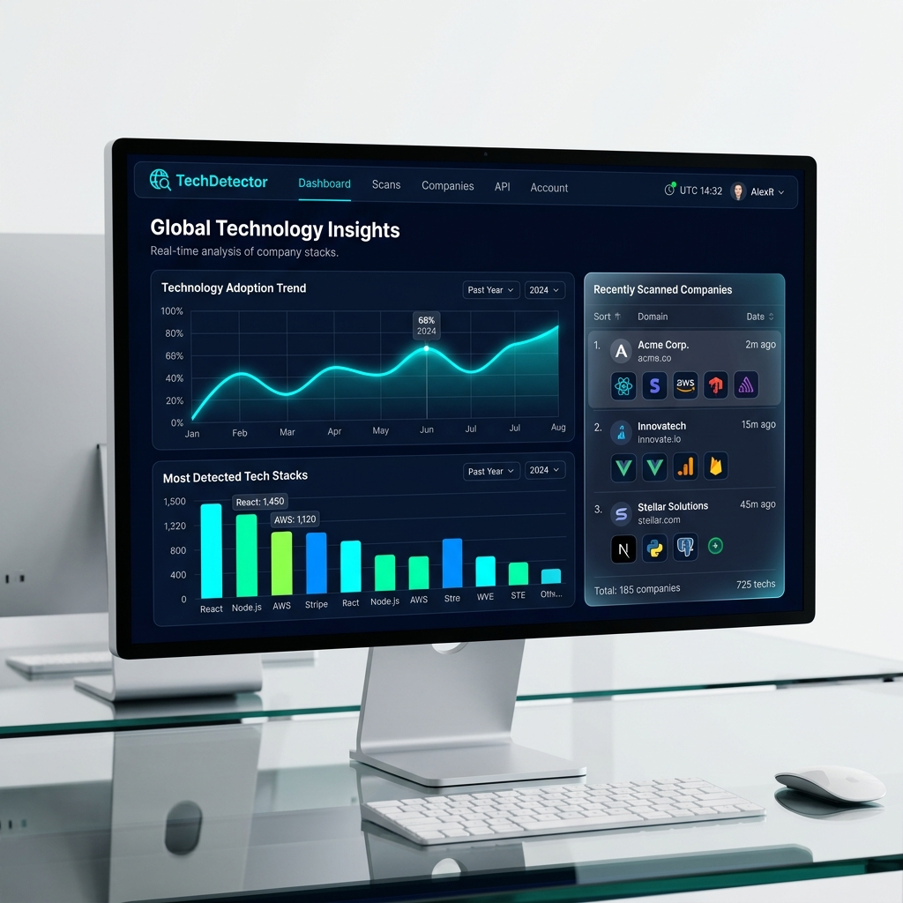
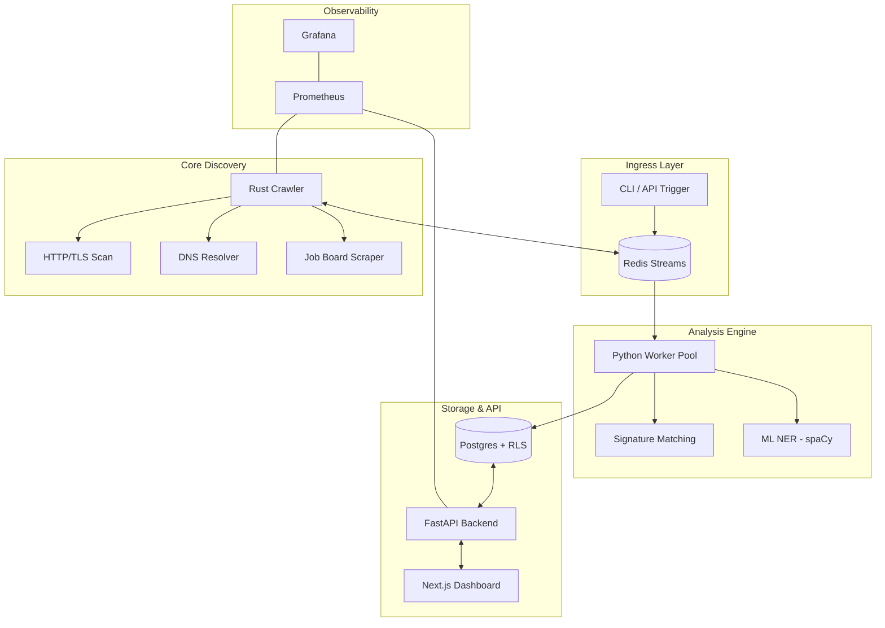

#  TechDetector

[](https://opensource.org/licenses/MIT)
[](https://www.rust-lang.org/)
[](https://www.python.org/)
[](https://fastapi.tiangolo.com/)
[](https://nextjs.org/)
[](https://redis.io/)
[](https://www.postgresql.org/)
[](https://www.docker.com/)
[](https://kubernetes.io/)
[](https://spacy.io/)
[](https://prometheus.io/)
[](https://grafana.com/)

**TechDetector** is a high-performance, distributed technographic discovery engine designed to identify software stacks at scale. By combining low-latency network primitives with advanced NLP/ML extraction, TechDetector provides deep visibility into the technologies powering any organization.

---

## 📖 Table of Contents
- [🚀 Key Features](#-key-features)
- [📺 Visual Demo](#-visual-demo)
- [🏎 Performance](#-performance)
- [🏗 System Architecture](#-system-architecture)
- [🔍 Detection Deep Dive](#-detection-deep-dive)
- [🛠 Tech Stack](#-tech-stack)
- [🚥 Quick Start](#-quick-start)
- [🗺 Roadmap](#-roadmap)
- [🛡 License](#-license)

---

## 🚀 Key Features

*   **Multi-Vector Detection**: Analyzes domains across four distinct dimensions:
    -   **HTML Source**: Regex and pattern-based signature matching (1,500+ signatures).
    -   **HTTP Headers**: Identifying servers, CDNs, and security layers.
    -   **DNS Records**: Scanning MX, TXT, and CNAME records for SaaS integrations.
    -   **ML-Enhanced NER**: Custom-trained spaCy model for extracting technology mentions from job postings.
*   **High-Concurrency Crawler**: A blazingly fast Rust-based crawler built for massive scale.
*   **Enterprise Multi-Tenancy**: Built-in organization isolation using PostgreSQL Row-Level Security (RLS).
*   **Interactive Analytics**: Next.js 14 dashboard for data exploration and trend visualization.

---

## 📺 Visual Demo


*Modern, dark-mode analytics dashboard showing real-time technology adoption trends and company profiles.*

---

## 🏎 Performance

TechDetector is engineered for speed. The Rust-based crawler leverages `tokio` for non-blocking I/O, allowing it to handle massive concurrency with a minimal footprint.

- **Concurreny**: Effortlessly handles **1,000+ concurrent domain scans**.
- **Latency**: Sub-second discovery for HTML and Header-based vectors.
- **Resource Efficiency**: Crawler memory usage remains **< 300MB** even under heavy load.
- **Elastic Scaling**: Scaling is as simple as adding more Python worker containers to the Redis Stream.

---

## 🔍 Detection Deep Dive

### All-Vector Discovery
Unlike simple scanners, TechDetector looks at every signal a domain emits:

1.  **HTML Source**: We look for script tags, unique ID attributes, and class names tied to specific libraries like React or Vue.
2.  **HTTP Headers**: We detect infrastructure components (Nginx, Vercel, Cloudflare) and security tools by analyzing response headers.
3.  **DNS Records**: We resolve MX, SPF, and TXT records to identify third-party providers for email (SendGrid), verification (Google Site Verification), and more.
4.  **ML-Enhanced NER**: Our spaCy model scans company job boards and career pages to find mentions of specific databases (Snowflake, MongoDB) or frameworks that don't appear in the frontend code.

---

## 🏗 System Architecture



---

## 🛠 Tech Stack

| Layer | Technologies |
| :--- | :--- |
| **Crawler** | Rust, Tokio, Reqwest, Tracing |
| **Worker Pool** | Python 3.11, Asyncio, Pydantic, spaCy 3.7 |
| **Streaming** | Redis (Streams, Pub/Sub) |
| **Database** | PostgreSQL 15 (RLS, JSONB) |
| **Backend API** | FastAPI, JWT, SQLAlchemy |
| **Frontend** | Next.js 14, TailwindCSS, Tremor |
| **Infrastructure** | Docker, Kubernetes, Helm |
| **Monitoring** | Prometheus, Grafana |

---

## 🚦 Quick Start

### Prerequisites
- **Docker & Docker Compose**: Version 2.20+ recommended.
- **RAM**: Minimum 4GB for the full stack.

### Local Development

1.  **Clone and Start:**
    ```bash
    git clone https://github.com/NITIN9181/Distributed-Technographic-Discovery-Engine.git
    cd Distributed-Technographic-Discovery-Engine
    docker-compose up -d
    ```

2.  **Access the Dashboard:** Open [http://localhost:3000](http://localhost:3000)

---

## 🗺 Roadmap

- [ ] **Phase 7**: AI-driven automatic signature generator.
- [ ] **Phase 8**: Native CRM integrations (HubSpot, Salesforce).
- [ ] **Phase 9**: Chrome Extension for on-the-fly technographic scouting.
- [ ] **Phase 10**: Global technology usage market share reports.

---

## 📄 Documentation
- [Project Evolution: Phase 0-6](phase6.md)
- [API Reference](docs/API.md)
- [Architecture Deep Dive](docs/ARCHITECTURE.md)
- [Operational Runbooks](docs/RUNBOOKS.md)

---

## 🛡 License

Distributed under the MIT License. See `LICENSE` for more information.

---

<p align="center">
  Built with ❤️ by Nitin
</p>
