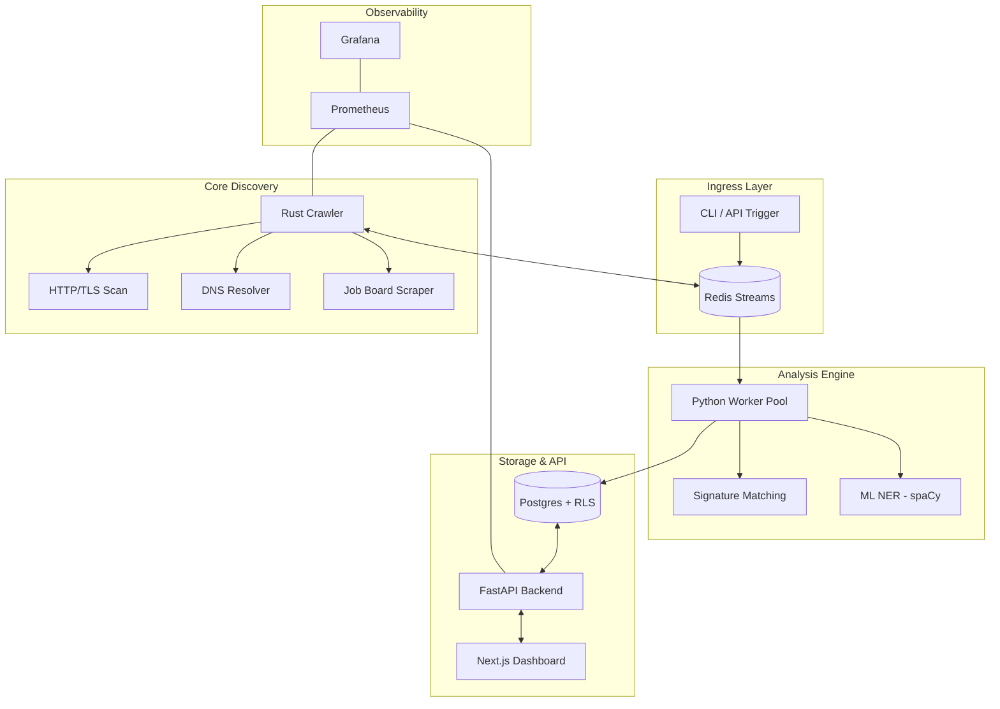

#  TechDetector

[](https://opensource.org/licenses/MIT)
[](https://www.rust-lang.org/)
[](https://www.python.org/)

**TechDetector** is a high-performance, distributed technographic discovery engine designed to identify software stacks at scale. By combining low-latency network primitives with advanced NLP/ML extraction, TechDetector provides deep visibility into the technologies powering any organization.

---

## 🚀 Key Features

*   **Multi-Vector Detection**: Analyzes domains across four distinct dimensions:
    -   **HTML Source**: Regex and pattern-based signature matching (1,500+ signatures).
    -   **HTTP Headers**: Identifying servers, CDNs, and security layers.
    -   **DNS Records**: Scanning MX, TXT, and CNAME records for SaaS integrations.
    -   **ML-Enhanced NER**: Custom-trained spaCy model for extracting technology mentions from job postings.
*   **High-Concurrency Crawler**: A blazingly fast Rust-based crawler capable of scanning thousands of domains concurrently with built-in rate limiting and robots.txt compliance.
*   **Scalable Architecture**: Decoupled design using Redis Streams to bridge the Rust discovery layer and Python detection workers.
*   **Enterprise Features**:
    -   **Multi-Tenancy**: Built-in organization isolation using PostgreSQL Row-Level Security (RLS).
    -   **Interactive Dashboard**: Next.js 14 dashboard for data exploration, trend analysis, and company profiling.
    -   **Webhook Support**: Real-time event notifications for new technology detections.
    -   **REST API**: Comprehensive FastAPI-based REST backend with JWT and API Key authentication.

---

## 🏗 System Architecture

The following diagram illustrates the high-level data flow from initial domain discovery to the final analytics dashboard.



---

## 🛠 Tech Stack

| Layer | Technologies |
| :--- | :--- |
| **Crawler** | Rust (Tokio, Reqwest, Tracing) |
| **Worker Pool** | Python (Asyncio, Pydantic, spaCy 3.7) |
| **Streaming** | Redis (Streams, Pub/Sub) |
| **Database** | PostgreSQL 15 (RLS, JSONB) |
| **Backend API** | FastAPI, JWT, SQLAlchemy |
| **Frontend** | Next.js 14, TailwindCSS, Tremor, Lucide |
| **Infrastructure** | Docker, Kubernetes, Helm |
| **Monitoring** | Prometheus, Grafana |

---

## 🚦 Quick Start

### Local Development (Docker Compose)

Get the entire stack running locally in minutes:

1.  **Clone the repository:**
    ```bash
    git clone https://github.com/NITIN9181/Distributed-Technographic-Discovery-Engine.git
    cd Distributed-Technographic-Discovery-Engine
    ```

2.  **Start the services:**
    ```bash
    docker-compose up -d
    ```

3.  **Initialize the database:**
    ```bash
    docker-compose exec api alembic upgrade head
    ```

4.  **Access the applications:**
    -   **Dashboard**: [http://localhost:3000](http://localhost:3000)
    -   **API Documentation**: [http://localhost:8000/docs](http://localhost:8000/docs)
    -   **Grafana**: [http://localhost:9000](http://localhost:9000) (Admin / admin)

### Manual Scan via CLI

```bash
python -m techdetector.cli scan google.com --vector all
```

---

## 📈 Detection Vectors & Signatures

TechDetector maintains an extensive library of signatures in `techdetector/signatures.json`.

*   **Analytics**: Google Analytics, Segment, Mixpanel, Amplitude, etc.
*   **Infrastructure**: AWS CloudFront, Cloudflare, Akamai, Netlify, Vercel.
*   **Frameworks**: React, Vue.js, Angular, Next.js, Nuxt.js.
*   **CMS & E-commerce**: WordPress, Shopify, Magento, WooCommerce, Webflow.
*   **SaaS/CRM**: HubSpot, Marketo, Intercom, Zendesk, Salesforce.

---

## 📄 Documentation

- [Project Evolution: Phase 0-6](phase6.md)
- [API Reference](docs/API.md)
- [Architecture Deep Dive](docs/ARCHITECTURE.md)
- [Operational Runbooks](docs/RUNBOOKS.md)
- [Troubleshooting Guide](docs/TROUBLESHOOTING.md)


---

## 🛡 License

Distributed under the MIT License. See `LICENSE` for more information.

---

<p align="center">
  Built with ❤️ by Nitin
</p>
